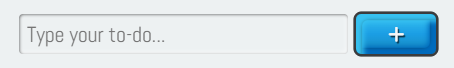
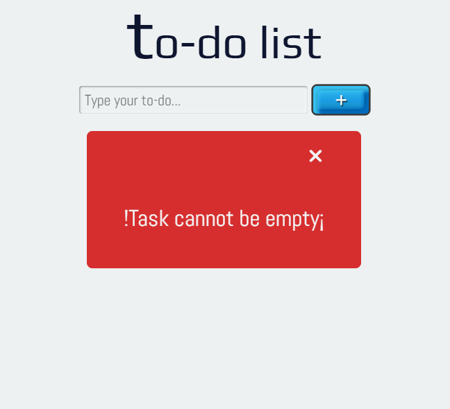
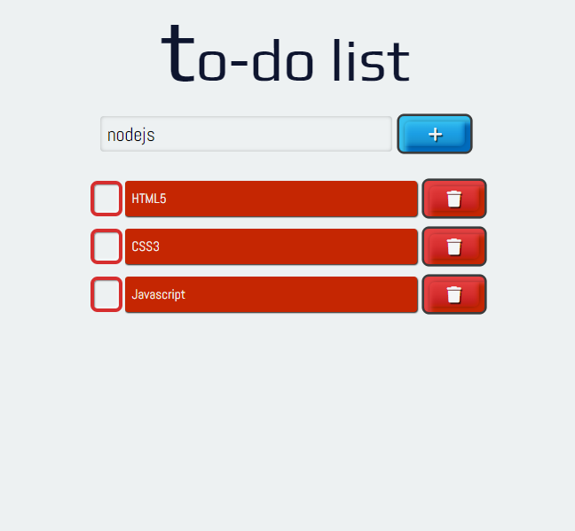
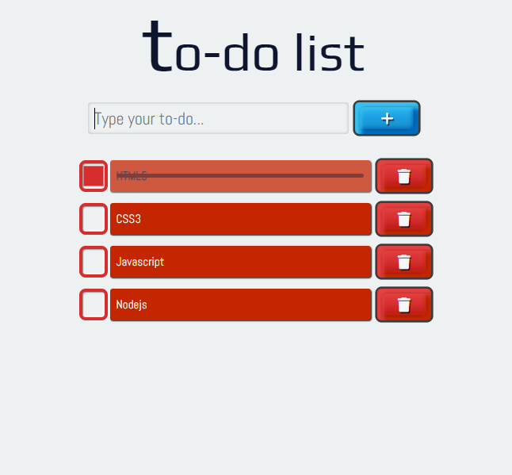
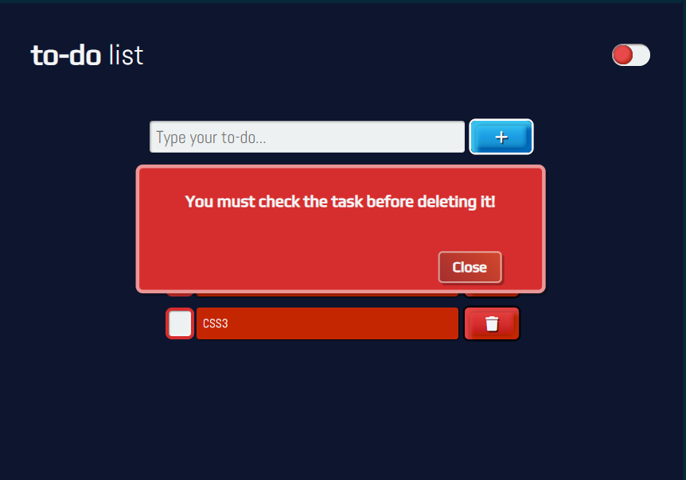
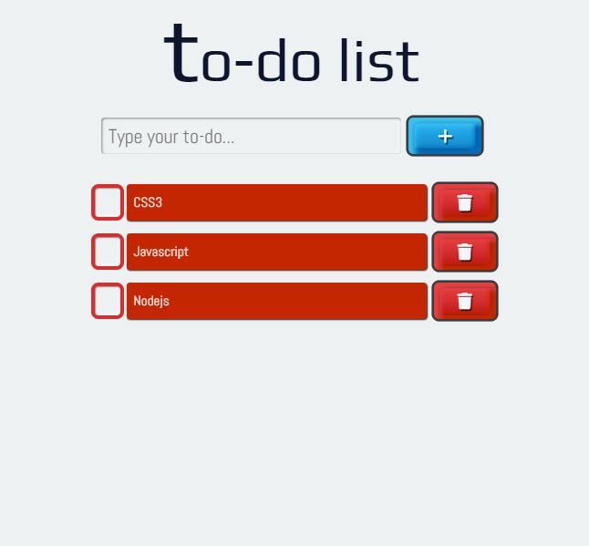
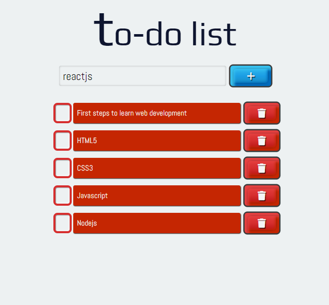

# 📝 Todo List JS

This project is a task list application developed with HTML5, CSS3 and JavaScript. It allows users to easily add and delete tasks.

## Features
----

- **Add tasks:** Allows adding new tasks to the list.
- **Delete tasks:** Ability to delete specific tasks.
- **Mark task:** Check any task before deleting it.
- **User-friendly interface:** Simple and easy-to-use design.

## Technologies Used
----

__Developer tools__

- [HTML5](https://developer.mozilla.org/en-US/docs/Web/HTML): Application structrue.
- [CSS3](https://developer.mozilla.org/en-US/docs/Web/CSS): Interface styling.
- [JavaScript](https://developer.mozilla.org/en-US/docs/Web/JavaScript): Application logic.

__Source code editor__

- [VSCode](https://code.visualstudio.com)

__Tool__

- [GIT](https://git-scm.com)

## 🚀 Installation
----

### Prerequisites

- [Node.js](https://nodejs.org/) (v16 or higher): only needed if you want to run unit tests. 
- [npm](https://www.npmjs.com/): it's usually installed together with Node.js.

### Steps to Install and Run

1. Clone this repository:
  ```bash
  git clone https://github.com/your-username/todo-list-js.git
  ```
2. Navigate to the project directory:
  ```bash
  cd todo-list-js
  ```
3. Open the main file in your browser:
- Open the `index.html` file in your browser.

### (Optional) Install Dependencies and Run Test

If you want to run automated tests:

4. Install dependencies: _npm install_.
5. Run unit tests: _npm test_.

## 🧹 Code Formatting
----

This project uses [Prettier](https://prettier.io) to keep code style consistent across the repository.

You can use Prettier in two ways:

### 1. Using the Prettier extension in your editor (recommended for VSCode)

- Install the "Prettier - Code formatter" extension from VSCode marketplace.
- Configure your editor to use the project's `.prettierrc` file and format code automatically on save.
- This ensures your code follows the same styles as the rest of the project.

### 2. Using Prettier as a project dependency

- If you want to sure everyone uses the same Prettier version, install it locally: `npm install prettier --save-dev`.
- To format all code in the project, run `npx prettier --write`.
- This guarantees that formatting is identical for all contributors, regardlesss of their editor setup.

### Notes

- The project's Prettier configuration can be found in the `.prettierrc`file.
- If you're contributing, please format your code before committing to avoid conflicts and maintain consistency.

## 🛠️ Usage
----

To run the project, you can use the following commnad if you use a dependency.

```bash
npm start
```
Or open the main (`index.html`) file in your browser.

Once you have opened the project in the browser, you can follow the these steps:

1. Enter a task in the input field.
2. Click the "Add" button to add it to the list.
3. Mark a task before deleting it.
4. Delete tasks using the corresponding button.

> **NOTE**: To understand the working logic of the to-do list in detail (how items are stored, added and deleted), you can refer to the source code in the `modules/add_todo.js` file.

## 🤝 Contributing
----

Contributions are welcome! If you want to improve this project, please follow these steps:

1. Fork the repository.
2. Create a new branch:
  ```bash
  git checkout -b feature/new-feature
  ```
3. Make your changes and commit them:
  ```bash
  git commit -m "Add new feature"
  ```
4. Push your changes:
  ```bash
  git push origin feature/new-feature
  ```
5. Open a Pull Request.

Don't forget to follow the code formatting guidelines above.

## 🧱 Project Structure
----

```
└── 📁todo-list-js
    └── 📁__tests__
        └── addTodo.test.js
        └── deleteTodo.test.js
        └── example.test.js
        └── theme.test.js
    └── 📁_fns
        └── custom_functions.js
    └── 📁assets/images
    └── 📁coverage
    └── 📁css
        └── index.css
    └── 📁hooks
        └── delete_local_storage.js
        └── save_local_storage.js
        └── theme.js
    └── 📁js
        └── index.js
    └── 📁modules
        └── add_todo.js
        └── delete_todo.js
    └── 📁utils
        └── debounce.js
    └── .babelrc
    └── .gitignore
    └── index.html
    └── jest.config.js
    └── jest.setup.js
    └── LICENSE
    └── package-lock.json
    └── package.json
    └── README.md
```

## 🧪 Tests
----

This project includes unit tests located in the `__tests__` folder. The following examples are not part of this project, they are taken as a references to be used in this file:

- **`addTodo.test.js`**: Verifies the functionality of adding tasks.
  ```javascript
  const { addTodo } = require('../src/taskManager');

  test('should add a new task to the list', () => {
    const tasks = [];
    const newTask = 'Buy groceries';
    const updatedTasks = addTodo(tasks, newTask);
    expect(updatedTasks).toContain(newTask);
  });
  ```

- **`deleteTodo.test.js`**: Ensures tasks are correctly removed from the list.
  ```javascript
  const { deleteTodo } = require('../src/taskManager');

  test('should delete a task from the list', () => {
    const tasks = ['Buy groceries', 'Clean the house'];
    const taskToDelete = 'Buy groceries';
    const updatedTasks = deleteTodo(tasks, taskToDelete);
    expect(updatedTasks).not.toContain(taskToDelete);
  });
  ```

To run the tests, use the following command:

```bash
npm test
```

If you installed jest as a *Dev Dependencies* in your project, you can use the following command to run the tests.

```bash
npx jest
```

To see the complete test code, please go to the corresponding file in this project.

## ¿What is JSDoc?
----

[JSDoc](https://jsdoc.app) is a JavaScript documentation that uses tags to describe additional information about parameters and their return value, also a powerful tool for documenting JavaScript code.

Not only do they help other developers understand how to use your code, but they can also be used to generate automatic documentation.

Some of the advantages of using JSDoc tags are:

- Improves code readability.
- Makes the code easier to understand to other developers.
- Allows automatic documentation generation.
- Helps detect errors and inconsistencies in the code.
- Improve team collaboration.
<small style="font-size: .65rem">[META]</small>

Some of the most common JSDoc tags are: 

- @function
- @description
- @param
- @returns 

### Basic Syntaxis

```js
  /**
   * 
   * Description of the function
   * @param { type } nameOfParam: description of parameter
  */

 function myFunction(nameOfParam){
  // code goes here
 }
```

### Explanation

- __@function:__ refers to a function and usually used in conjunction with the function name.
- __@description:__ indicates detailed information about the functions, variables, classes or methods that are documented.
- __@param:__ is a tag used in function and method documentation to be describe the parameters that are passed to functions.
- __{ type }:__ specifies the data type of parameter, for example (string, number, object) etc.
- __@returns:__ is a tag used to describe the return value of a function.
- __nameOfParam:__ is the name of parameter.

### Example

```js
  /**
   * 
   * @function sum
   * @description: calculate the sum of two numbers
   * @param { number } a: return the value of a
   * @param { number } b: return the value of b
   * @returns { number } return the sum of a and b
  */

  function sum(a, b){
    return a + b
  }
```

The following functions described below use JSDoc tags to discribe the purpose of each function and the parameters these function receive.

The JSDoc is not available in the examples below, but you can see them in the repository.

## Debounce
----

The ```debounce()``` function forces a function to wait a few times before running the execution and preventing from being called several times.

```js
  export function debounce(fun, wait, immediate){
    let timer;
    let later = () => {
      if(!immediate){
        func.apply(this, arguments)
      }
    }

    return (...args) => {
      const context = this;
      clearTimeout(timer);
      timer = setTimeout(later, wait);

      const callNow = immediate && !timer;
      if(callNow){
        func.apply(context, args)
      }
    }
  }
```

## Snippet Code
-----

### Structure

- HTML is responsible for adding the structure of a web page or website.
- In the `index.html` file, we find the basic structure of a To-Do list, to which tasks are dynamically added using JavaScript.

__HTML (`index.html`)__

```html
<!DOCTYPE html>
<html lang='en'>
<head>
  <!-- Basic Page Needs -->
  <meta charset='UTF-8'>
  <meta name='description' content=''>
  <meta name='author' content=''>
  <meta http-equiv='X-UA-Compatible' content='IE=edge'>
  <!-- Mobile Specific Metas -->
  <meta name='viewport' content='width=device-width, initial-scale=1.0'>
  <title>To-do List</title>
  <!-- Fonts -->
  <link rel='stylesheet' href='https://fonts.googleapis.com/css2?family=Abel&family=Play&display=swap'>
  <!-- CSS -->
  <link rel='stylesheet' href='https://cdnjs.cloudflare.com/ajax/libs/font-awesome/6.4.0/css/all.min.css'>
  <link rel='stylesheet' href='css/index.css'>
</head>
<body>
  <div class='container'>
    <header class="header">
      <h1 class="heading">to-do list</h1>
    </header>
    <div class="form--container">
      <form action="#" data-form>
        <input class="todo todo--input" type="text" placeholder="Type your to-do..." data-input>
        <button class="btn add--btn" type="submit" data-submit>
          <i class="icon fa-solid fa-plus"></i>
        </button>
      </form>
      <ul class="todo todo--list" data-list></ul>
    </div>
  </div>
  <script src='js/index.js' type="module"></script>
</body>
</html>
```

### Styles

- CSS styles are responsible for transforming the user interface __(UI)__ of a web page or website to make it pleasing to the eye of the user or end users.
- The `index.css` file contains the styles used to modify the UI of the To-Do list. This includes the buttons (add and delete), inputs (text and checkboxes), items, header, etc.

__CSS (`css/index.css`)__

```css
.btn {
  width: 5rem;
  height: var(--hgt);
  padding: calc(var(--pd) * .285) var(--pd);
  font-size: var(--pd);
  color: var(--light-color);
  box-shadow: .1vmin .2vmin .25vmin rgba(0,0,0,.85);
  .icon { pointer-events: none; }
  &:active { transform: scale(.99); }
}

.add--btn { 
  background: linear-gradient(
    180deg,
    hsl(195, 87%, 58%),
    hsl(201, 79%, 50%),
    var(--add-color)
  );
  box-shadow: 1.25vmin 1.25vmin .25lh hsl(195, 87%,58%) inset, 1vmin 1vmin 0 0 rgba(0,0,0,.7) inset, -1.25vmin -1.25vmin .25lh hsl(206,100%,37%) inset, -1vmin -1vmin 0 0 rgba(0,0,0,.7) inset, 0 0 0 .125lh rgba(0,0,0,.75);
  text-shadow: .25vmin .35vmin .05lh rgba(0,0,0,.7);
}

.trash--btn {
  --darken: hsl(0 86% 37%);
  padding-block: .35rem; 
  background: linear-gradient(
    180deg,
    hsl(360, 77%, 58%),
    var(--trash-color),
    var(--darken)
  );
  box-shadow: 1.25vmin 1.25vmin .25lh hsl(360, 77%, 58%) inset, 1vmin 1vmin 0 0 rgba(0,0,0,.7) inset, -1.25vmin -1.25vmin .25lh hsl(371, 98%, 39%) inset, -1vmin -1vmin 0 0 rgba(0,0,0,.7) inset, 0 0 0 .125lh rgba(0,0,0,.75);
  text-shadow: .25vmin .35vmin .05lh rgba(0,0,0,.7); 
}

.container {
  position: relative;
  .form--container {
    max-width: 30rem;
    & form {
      gap: 0 var(--rd);
      .todo--input { 
        width: min(50vw, var(--sz));
        height: var(--hgt);
        padding-inline-start: var(--rd);
        background: var(--light-gray);
        box-shadow: .125vmin .125vmin .1lh rgba(0,0,0,.5) inset, -.25vmin -.25vmin .15lh rgba(255,255,255,.75) inset;
        border: none;
        border-radius: calc(var(--rd) * .5);
        &:focus { 
          outline: none;
          box-shadow: 0 0 .15lh rgba(0,0,0, .25) inset;
        } 
      }
    }

  /*More code here*/
}

```

### Functionality

- JavaScript is responsible for providing interactivity or funcionality to a web page or website.
- The `index.js` file is responsible for initializing the To-Do list.

__JavaScript (`js/index.js`)__

```js
import {initTodoList} from '../modules/add_todo.js';
initTodoList()
```

## (UI/UX) Design
-----

### ¿What is UI/UX Design?

- UI (User Interface): refers to the visual appearance of an application or website, including elements such as buttons, menus, colors and fonts.

- UX (User Experience): focuses on the user's experience when interacting with an application, from ease of use to overall satisfaction.
<small style="font-size: .65rem">[GEMINI]</small>

### (UI/UX) Design Explanation

1. __Input field:__

An input field allows us to enter information or a task to be added to a list, when the "Add" button is pressed.



2. __Alert message:__

_There is an important point to note_: if the input field does not contain a task, it cannot be added to the list when pressing the "Add" button.

A message will appear informing the user that the input field must not be empty. Once the information window is closed, the user can re-enter the task to add it to the list.



3. __Add to list:__

When the "Add" button is pressed, the task is added to a list located at the bottom of the form.



4. __Check task:__

As you can see in the image below, the task is accompanied by a selection field and a "Delete" button. Each time the user wants to delete a task, it must be marked for deletion from the list; otherwise, it cannot be deleted. A message will appear informing the user that they must mark the task before deleting it.



In the second image, as you can see, an alert messsage is displayed informing the user that they must check a task before deleting it.



5. __Delete from list:__

Once the task has been selected, it will be deleted when the respective button is pressed.



6. __To-do list:__



## Dark Mode
----

The application supports a dark mode feature to enhance usability in low-light environments and reduce eye strain.

### How Dark Mode Works

- **Toggle Mechanism:** A toggle button or switch allows users to switch between light and dark themes.
- **CSS Implementation:** Dark mode is achieved using additional CSS classes or variables that adjust background, text, and accent colors.
- **Persistence:** The selected mode can be saved in local storage, so your preference is remembered on future visits.

### Example: JavaScript Dark Mode Toggle

Below is a simple example of how you can implement a dark mode toggle using JavaScript and CSS:

__HTML__

```html
<button id="darkModeToggle">Toggle Dark Mode</button>
```

__CSS__

```css
body.dark-mode {
  background-color: #181a1b;
  color: #f1f1f1;
}
```

__JavaScript__

```js
const toggle = document.getElementById('darkModeToggle');
toggle.addEventListener('click', () => {
  document.body.classList.toggle('dark-mode');
  // Optionally save preference
  localStorage.setItem('darkMode', document.body.classList.contains('dark-mode'));
});

// On page load, restore preference
if (localStorage.getItem('darkMode') === 'true') {
  document.body.classList.add('dark-mode');
}
```

This code adds a button to toggle dark mode, updates the page style, and saves the user's preference in local storage.

### Example

When dark mode is enabled:
- Backgrounds become darker.
- Text and icons switch to lighter colors for better contrast.
- Buttons and input fields adapt to the dark theme.

> **Tip:** If you want to customize the dark mode appearance, edit the relevant CSS rules in the `index.css` file.


## 🗎 License
----

This project is licensed under the MIT License. See the `LICENSE` file for more details.